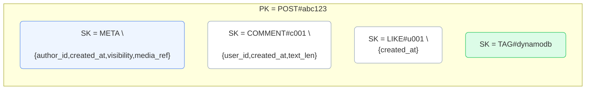

# Feed Diagrams

### B3 ITEM-COLLECTION-POST
_Missing diagram_

### B4 INDEX-OVERLAY
_Missing diagram_

### B5 SHARDED-FEEDS
_Missing diagram_

### B6 STREAMS-PIPELINE
_Missing diagram_

### B7 IDEMPOTENT-LIKE-SEQUENCE
_Missing diagram_

### Item Collection — POST
